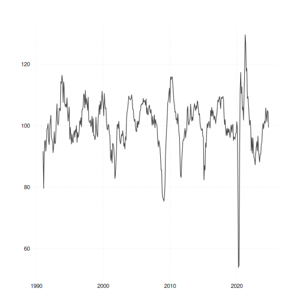

# GitHub Actions Demo

The workflow defined in .github/workflow/main.yml uses this markdown template to create an up to date time series chart of the KOF Barometer.
The KOF Swiss Economic Insitute updates its forward looking indicator on a monthly basis. This markdown documents queries the kofdata API
and renders a chart using the tsbox package.

The render process itself is executed via GitHub Actions on a docker (rocker/verse) tidyverse container with a few custom tweaks (basically installation of the above packages).
We stop short of creating HTML documents as GitHub renders markdown by default. Hence we just render RMarkdown to standard markdown.

## KOF Economic Barometer


```r
library(kofdata)
library(tsbox)

tsl <- get_time_series("ch.kof.barometer")
ts_plot(tsl$ch.kof.barometer)
```



```r
message(sprintf("last update on %s.", as.character(Sys.Date())))
```
